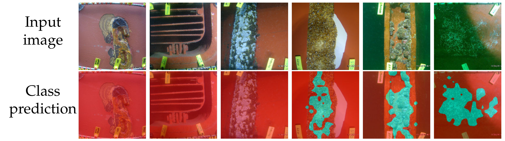

# Automating the assessment of biofouling

This repository includes code and sample images to run biofouling detection models trained using the [ComFe][https://arxiv.org/abs/2403.04125] method and a [DINOv2][https://github.com/facebookresearch/dinov2] backbone. These models are trained to detect the presence of an unwater hull or other structure, biofouling, paint damage, and niche areas.

See the inference script for details on running the ONNX model, which can be downloaded [here][https://figshare.com/articles/dataset/Automating_the_assessment_of_biofouling_in_images/26537158].

